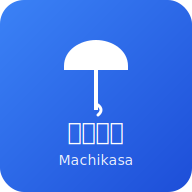

# 🌂 Machikasa (まちかさ) - 福井大学傘シェアリングアプリ

<div align="center">



**地域密着型の傘シェアリングプロトタイプアプリ**

[](https://nextjs.org/)
[](https://www.typescriptlang.org/)
[](https://web.dev/progressive-web-apps/)
[](https://tailwindcss.com/)

[🚀 デモを見る](#デモ) • [📱 使い方](#使い方) • [🔧 開発](#開発者向け) • [📋 ドキュメント](#ドキュメント)

</div>

> 雨の日をみんなで支える、持続可能な地域コミュニティの傘シェアリングプラットフォーム

## 📖 概要

**Machikasa**は福井大学をモデルとした地域密着型傘シェアリングアプリのプロトタイプです。学生や地域住民が急な雨天時に傘をシェアできる低コストで持続可能なソリューションを提供します。

### ✨ 主な特徴

- 🔍 **QRコードスキャン**: 傘のQRコードを読み取って簡単に借用・返却
- 🗺️ **リアルタイム地図**: Google Maps APIを使った傘ステーション位置表示
- 💾 **オフライン対応**: PWA技術でインターネット接続なしでも基本機能が利用可能
- 🎯 **ポイント制度**: 返却でポイント獲得、ゲーミフィケーション要素
- 🏪 **パートナー店舗**: 地域店舗との連携で返却場所を拡充
- 🌐 **多言語対応**: 日本語・英語切り替え機能
- 📊 **管理ダッシュボード**: リアルタイム統計とデータ管理
- 📱 **レスポンシブデザイン**: モバイルファーストのUI/UX

## 🎯 プロジェクト目標

1. **持続可能性**: 低コストで運営可能なシステム設計
2. **コミュニティ主導**: 地域住民による自律的な運営モデル
3. **テクノロジー活用**: 最新のWeb技術による使いやすいインターフェース
4. **プライバシー重視**: 個人データの最小化とローカル保存

## 🎯 主な機能

### 👥 ユーザー機能
- **QRコードスキャン**: 傘の借りる/返すをワンタッチで操作
- **ステーションマップ**: Google Maps風の地図で近くの傘ステーションを確認
- **ポイントシステム**: 返却で得られるポイントでコミュニティ参加を促進
- **利用履歴**: 個人の貸出・返却履歴を確認

### 🏪 ステーション管理
- **リアルタイム在庫管理**: 各ステーションの利用可能傘数を表示
- **営業時間管理**: ステーションごとの営業時間設定
- **ステータス監視**: 稼働状況の監視とアラート

### ⚙️ 管理者機能
- **統合ダッシュボード**: システム全体の利用状況を可視化
- **傘管理**: 各傘のステータス（利用可能/使用中/メンテナンス）を管理
- **ユーザー管理**: 登録ユーザーの統計と管理
- **取引履歴**: 全ての貸出・返却履歴の確認

## 🚀 クイックスタート

### 前提条件
- Node.js 18.0.0 以上
- npm または yarn

### インストール手順

1. **リポジトリをクローン**
   ```bash
   git clone <repository-url>
   cd MachiKasa
   ```

2. **依存関係をインストール**
   ```bash
   npm install
   # または
   yarn install
   ```

3. **開発サーバーを起動**
   ```bash
   npm run dev
   # または
   yarn dev
   ```

4. **ブラウザでアクセス**
   ```
   http://localhost:3000
   ```

## 🏗️ 技術スタック

- **フレームワーク**: Next.js 14 (App Router)
- **言語**: TypeScript
- **スタイリング**: Tailwind CSS
- **状態管理**: LocalStorage (ブラウザ内永続化)
- **QRスキャン**: @zxing/browser
- **地図表示**: Google Maps JavaScript API (シミュレーション)
- **デプロイ**: Vercel/Netlify 対応

## 📁 プロジェクト構造

```
MachiKasa/
├── app/                    # Next.js App Router ページ
│   ├── page.tsx           # ホームページ
│   ├── map/               # ステーションマップ
│   ├── scan/              # QRスキャナー
│   ├── profile/           # ユーザープロフィール
│   └── admin/             # 管理ダッシュボード
├── components/            # 再利用可能コンポーネント
│   ├── Navbar.tsx         # ナビゲーションバー
│   ├── QRScanner.tsx      # QRスキャナーコンポーネント
│   ├── StationCard.tsx    # ステーション情報カード
│   └── Button.tsx         # カスタムボタンコンポーネント
├── lib/                   # ユーティリティとデータ管理
│   ├── localDB.ts         # LocalStorage CRUD操作
│   ├── mockData.ts        # サンプルデータ
│   └── utils.ts           # ヘルパー関数
├── types/                 # TypeScript型定義
│   ├── umbrella.ts        # 傘関連の型
│   ├── station.ts         # ステーション関連の型
│   └── user.ts            # ユーザー関連の型
├── public/qr/             # QRコードサンプル画像
└── docs/                  # プロジェクトドキュメント
```

## 🎮 デモの使い方

### 1. ユーザー切り替え
右上のユーザー名をクリックして異なる役割（学生/店舗/管理者）を体験できます。

### 2. QRスキャン体験
- **スキャンページ**: カメラ許可後、デモ用QRコードをクリック
- **手動入力**: `machikasa://umbrella/umb-001` などを入力
- **借りる**: 利用可能な傘をスキャンして借りる
- **返す**: 使用中の傘をスキャンして返却（ポイント獲得）

### 3. 管理者機能
管理者ユーザーに切り替えて以下を確認:
- システム全体の統計
- 傘の詳細管理
- ユーザー利用状況
- データリセット機能

## 🔧 開発者向け情報

### カスタマイズ

**地図API統合**
```typescript
// lib/maps.ts (実装例)
import { Loader } from '@googlemaps/js-api-loader';

const loader = new Loader({
  apiKey: process.env.NEXT_PUBLIC_GOOGLE_MAPS_API_KEY!,
  version: 'weekly',
});
```

**外部API統合**
LocalDBクラスを拡張してRESTful APIやGraphQLエンドポイントと連携可能:

```typescript
// lib/api.ts
export class ApiClient extends LocalDB {
  static async syncWithServer() {
    // サーバーとの同期処理
  }
}
```

### テスト

```bash
# ユニットテスト実行
npm run test

# E2Eテスト実行
npm run test:e2e

# テストカバレッジ
npm run test:coverage
```

### ビルドとデプロイ

```bash
# プロダクションビルド
npm run build

# 本番サーバー起動
npm run start

# 静的エクスポート（Netlifyなど）
npm run export
```

## 🌐 デプロイメント

### GitHub Pages (自動デプロイ)
このプロジェクトはGitHub Actionsを使用した自動デプロイに対応しています：

1. **リポジトリ設定**
   ```bash
   git clone https://github.com/your-username/MachiKasa.git
   cd MachiKasa
   git push origin main
   ```

2. **GitHub Pages有効化**
   - リポジトリ設定 → Pages
   - Source: "GitHub Actions" を選択
   - ワークフローが自動実行される

3. **デプロイ完了**
   - `https://your-username.github.io/MachiKasa/` でアクセス可能

### Vercel (推奨)
1. GitHub連携でリポジトリをインポート
2. 環境変数を設定
3. 自動デプロイが実行される

### Netlify
1. `npm run build && npm run export`
2. `out/` ディレクトリをアップロード

### ローカル静的ビルド
```bash
# 静的ファイル生成
npm run build

# ビルド確認
npx serve out/
```

## 🤝 コントリビューション

1. **Issue作成**: バグ報告や機能提案
2. **Fork & PR**: 機能追加やバグ修正
3. **コードレビュー**: TypeScriptとTailwind CSSの規約準拠

### 開発ガイドライン
- **コードスタイル**: ESLint + Prettier設定に従う
- **コミット**: Conventional Commits形式
- **テスト**: 新機能には適切なテストを追加
- **ドキュメント**: README更新とコードコメント

## 📊 今後の拡張予定

### Phase 2: リアル統合
- [ ] 実際のGoogle Maps API統合
- [ ] デバイスカメラでのQRスキャン
- [ ] GPS位置情報連携
- [ ] リアルタイム通知

### Phase 3: エコシステム
- [ ] 天気予報API連携
- [ ] 決済システム統合
- [ ] AIによる需要予測
- [ ] IoTデバイス連携

## 📞 サポート

- **バグ報告**: [GitHub Issues](./issues)
- **機能要望**: [GitHub Discussions](./discussions)
- **質問**: [Wiki](./wiki) を参照

## 📄 ライセンス

MIT License - 詳細は [LICENSE](./LICENSE) ファイルを参照

---

**開発チーム**: 福井大学コミュニティプロジェクト  
**最終更新**: 2025年10月12日