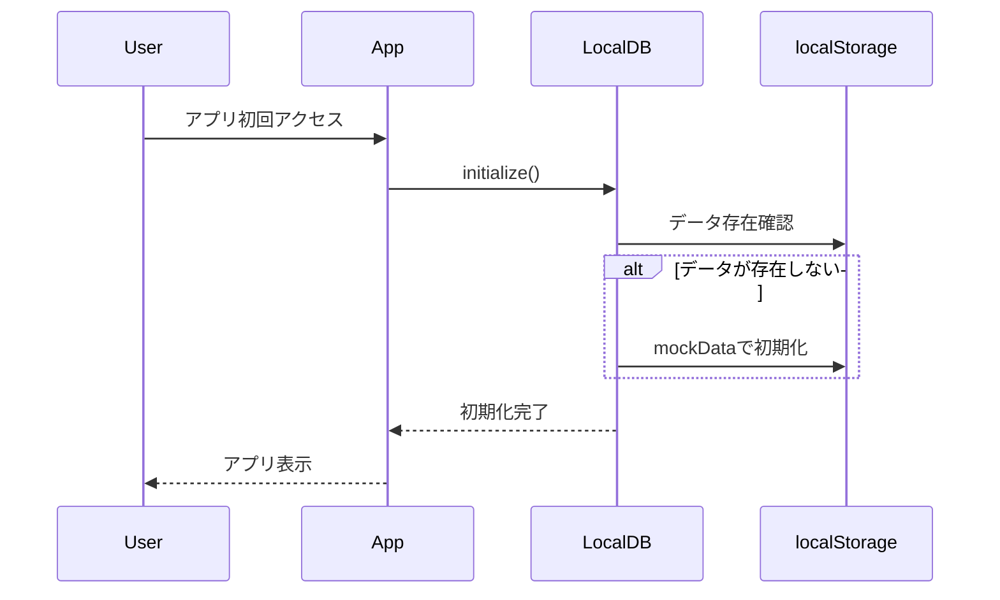
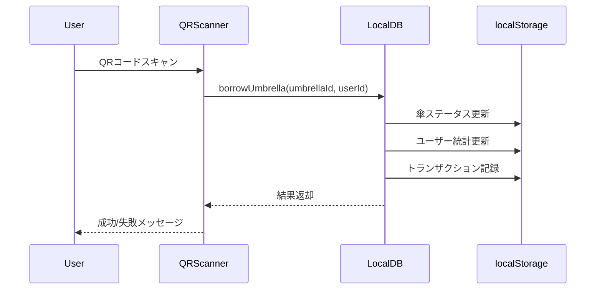
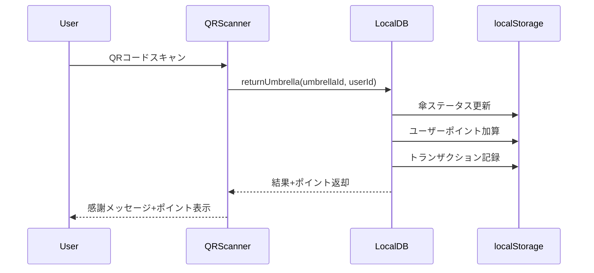

# Machikasa アーキテクチャ設計書

## 🏗️ システム概要

Machikasaは完全にクライアントサイドで動作するSPA（Single Page Application）として設計されており、外部のデータベースやAPIサーバーに依存せずに動作します。

## 📐 アーキテクチャ図

```
┌─────────────────────────────────────────────────────┐
│                   Browser Client                    │
├─────────────────────────────────────────────────────┤
│  Next.js 14 App Router + React Components          │
├─────────────────────────────────────────────────────┤
│  TypeScript Business Logic Layer                   │
│  ├─ LocalDB (localStorage wrapper)                 │
│  ├─ Mock Data Generator                             │
│  └─ Utility Functions                              │
├─────────────────────────────────────────────────────┤
│  Browser APIs                                      │
│  ├─ localStorage (Data Persistence)                │
│  ├─ Camera API (QR Scanning)                       │
│  └─ Geolocation API (Maps)                         │
└─────────────────────────────────────────────────────┘
```

## 🔄 データフロー

### 1. 初期化フロー


### 2. 傘の借用フロー


### 3. 傘の返却フロー


## 🗃️ データモデル

### LocalStorage Keys
```typescript
const STORAGE_KEYS = {
  STATIONS: 'machikasa_stations',      // ステーション情報
  UMBRELLAS: 'machikasa_umbrellas',    // 傘情報
  USERS: 'machikasa_users',            // ユーザー情報
  TRANSACTIONS: 'machikasa_transactions', // 取引履歴
  CURRENT_USER: 'machikasa_current_user', // 現在のユーザー
  INITIALIZED: 'machikasa_initialized'    // 初期化フラグ
} as const;
```

### エンティティ関係図
```
Users (1) ----< (∞) Transactions (∞) >---- (1) Umbrellas
                         |
                         |
                         v
                    Stations (1) ----< (∞) Umbrellas
```

## 🧩 コンポーネント設計

### 1. 階層構造
```
App Layout (Navbar + Main)
├── HomePage
│   ├── StationCard[]
│   └── TransactionHistory
├── MapPage
│   ├── MapSimulator
│   └── StationCard (selected)
├── ScanPage
│   ├── QRScanner
│   └── UmbrellaInfo
├── ProfilePage
│   ├── UserStats
│   ├── TransactionList
│   └── Achievements
└── AdminPage
    ├── Overview (Stats)
    ├── UmbrellaTable
    ├── StationTable
    ├── UserTable
    └── TransactionTable
```

### 2. 状態管理パターン
```typescript
// ローカル状態（useState）
const [scannedUmbrella, setScannedUmbrella] = useState<Umbrella | null>(null);

// グローバル状態（LocalDB）
const currentUser = LocalDB.getCurrentUser();
const umbrellas = LocalDB.getUmbrellas();

// 副作用（useEffect）
useEffect(() => {
  LocalDB.initialize();
  // データロード処理
}, []);
```

## 🔐 セキュリティ考慮

### データ保護
- **クライアントサイド**: localStorage暗号化は未実装（デモのため）
- **実装時**: CryptoJSなどでの暗号化を推奨
- **プライバシー**: 個人情報の最小化

### QRコード検証
```typescript
export function isValidMachikasaQR(qrCode: string): boolean {
  const pattern = /^machikasa:\/\/umbrella\/[\w-]+$/;
  return pattern.test(qrCode);
}
```

## 📱 レスポンシブ対応

### ブレークポイント設計
```css
/* Tailwind CSS クラス使用 */
sm: 640px   /* mobile landscape */
md: 768px   /* tablet */
lg: 1024px  /* desktop */
xl: 1280px  /* large desktop */
```

### モバイルファースト
- タッチスクリーン最適化
- QRスキャンのUX向上
- オフライン対応（PWA化可能）

## 🚀 パフォーマンス最適化

### 1. バンドルサイズ
```javascript
// 動的インポート例
const QRScanner = dynamic(() => import('@/components/QRScanner'), {
  ssr: false,
  loading: () => <div>Loading scanner...</div>
});
```

### 2. 画像最適化
```javascript
// Next.js Image component
import Image from 'next/image';

<Image
  src="./qr/umb-001.svg"
  alt="QR Code"
  width={200}
  height={200}
  priority={false}
/>
```

### 3. メモ化
```typescript
// コンポーネントメモ化
const StationCard = memo(({ station, ...props }) => {
  // レンダリング処理
});

// 計算結果キャッシュ
const memoizedStats = useMemo(() => {
  return calculateStats(umbrellas);
}, [umbrellas]);
```

## 🧪 テスト戦略

### 1. ユニットテスト
```typescript
// lib/localDB.test.ts
describe('LocalDB', () => {
  beforeEach(() => {
    localStorage.clear();
  });

  test('should initialize with mock data', () => {
    LocalDB.initialize();
    expect(LocalDB.getStations()).toHaveLength(3);
  });
});
```

### 2. 統合テスト
```typescript
// __tests__/scan-flow.test.tsx
import { render, screen, fireEvent } from '@testing-library/react';
import ScanPage from '@/app/scan/page';

test('QR scan borrow flow', async () => {
  render(<ScanPage />);
  // QRスキャンシミュレーション
  // アサーション
});
```

### 3. E2Eテスト
```typescript
// cypress/e2e/umbrella-sharing.cy.ts
describe('Umbrella Sharing Flow', () => {
  it('should complete borrow and return cycle', () => {
    cy.visit('/');
    cy.get('[data-testid="scan-button"]').click();
    // フロー検証
  });
});
```

## 🔧 拡張性設計

### 1. API統合準備
```typescript
// lib/api.ts (future implementation)
interface ApiClient {
  syncStations(): Promise<Station[]>;
  borrowUmbrella(umbrellaId: string): Promise<BorrowResult>;
  returnUmbrella(umbrellaId: string): Promise<ReturnResult>;
}

class LocalApiClient implements ApiClient {
  // LocalDB wrapper
}

class RemoteApiClient implements ApiClient {
  // REST API calls
}
```

### 2. プラグインアーキテクチャ
```typescript
// lib/plugins/
interface MachikasaPlugin {
  name: string;
  version: string;
  initialize(): void;
  onBorrow?(event: BorrowEvent): void;
  onReturn?(event: ReturnEvent): void;
}

// 例: ポイントシステムプラグイン
class PointsPlugin implements MachikasaPlugin {
  name = 'points-system';
  version = '1.0.0';
  
  onReturn(event: ReturnEvent) {
    // ポイント計算ロジック
  }
}
```

### 3. 設定管理
```typescript
// lib/config.ts
interface MachikasaConfig {
  features: {
    qrScanning: boolean;
    gpsTracking: boolean;
    weatherIntegration: boolean;
  };
  ui: {
    theme: 'light' | 'dark';
    language: 'ja' | 'en';
  };
  business: {
    pointsPerReturn: number;
    maxBorrowDuration: number;
  };
}
```

## 📊 監視・分析

### 1. 使用統計
```typescript
// lib/analytics.ts
export function trackEvent(event: string, properties?: Record<string, any>) {
  // ローカル統計記録
  const stats = LocalDB.getData('analytics', []);
  stats.push({
    event,
    properties,
    timestamp: new Date().toISOString(),
    sessionId: generateSessionId()
  });
  LocalDB.setData('analytics', stats);
}
```

### 2. エラー追跡
```typescript
// lib/error-tracking.ts
export function captureError(error: Error, context?: string) {
  console.error(`[Machikasa Error] ${context}:`, error);
  
  // ローカルエラーログ
  const errors = LocalDB.getData('errors', []);
  errors.push({
    message: error.message,
    stack: error.stack,
    context,
    timestamp: new Date().toISOString()
  });
  LocalDB.setData('errors', errors.slice(-100)); // 最新100件保持
}
```

## 🌍 国際化対応

### 1. 多言語化
```typescript
// lib/i18n.ts
const messages = {
  ja: {
    'umbrella.borrow': '傘を借りる',
    'umbrella.return': '傘を返す',
  },
  en: {
    'umbrella.borrow': 'Borrow Umbrella',
    'umbrella.return': 'Return Umbrella',
  }
};

export function t(key: string, locale = 'ja'): string {
  return messages[locale]?.[key] || key;
}
```

### 2. 地域対応
```typescript
// lib/localization.ts
interface RegionConfig {
  currency: string;
  dateFormat: string;
  weatherApi: string;
  mapCenter: { lat: number; lng: number };
}

const regions = {
  fukui: {
    currency: 'JPY',
    dateFormat: 'YYYY/MM/DD',
    weatherApi: 'jma',
    mapCenter: { lat: 36.0668, lng: 136.2189 }
  }
};
```

---

この設計書は実装と並行して更新され、システムの理解と拡張の指針として活用されます。