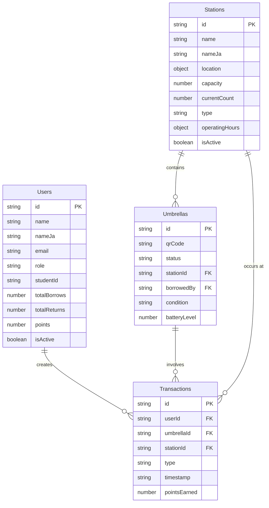

# Machikasa データモデル設計書

## 📊 データモデル概要

Machikasaシステムは4つの主要エンティティで構成されています：
- **Users** (ユーザー)
- **Stations** (ステーション)  
- **Umbrellas** (傘)
- **Transactions** (取引履歴)

## 🗂️ エンティティ詳細

### 1. Users (ユーザー)

```typescript
interface User {
  id: string;                    // 一意識別子 (例: "user-1")
  name: string;                  // 英語名 (例: "Takeshi Yamada")
  nameJa: string;                // 日本語名 (例: "山田武志")
  email: string;                 // メールアドレス
  role: UserRole;                // 'student' | 'store' | 'admin'
  studentId?: string;            // 学籍番号 (学生のみ)
  department?: string;           // 所属学部・部署
  phone?: string;                // 電話番号
  totalBorrows: number;          // 総貸出回数
  totalReturns: number;          // 総返却回数
  points: number;                // 獲得ポイント
  isActive: boolean;             // アクティブ状態
  createdAt: string;             // 登録日時 (ISO string)
  lastLoginAt: string;           // 最終ログイン日時
}

type UserRole = 'student' | 'store' | 'admin';
```

**ビジネスルール:**
- `studentId`は学生ロールのみ必須
- `points`は返却時に加算（基本20pt/回）
- `totalBorrows >= totalReturns`が常に成立

### 2. Stations (ステーション)

```typescript
interface Station {
  id: string;                    // 一意識別子 (例: "station-1")
  name: string;                  // 英語名
  nameJa: string;                // 日本語名
  location: {                    // GPS座標
    lat: number;                 // 緯度
    lng: number;                 // 経度
  };
  address: string;               // 英語住所
  addressJa: string;             // 日本語住所
  capacity: number;              // 最大収容可能傘数
  currentCount: number;          // 現在の利用可能傘数
  type: StationType;             // 'university' | 'store' | 'public'
  operatingHours: {              // 営業時間
    open: string;                // 開始時刻 (例: "09:00")
    close: string;               // 終了時刻 (例: "21:00")
  };
  isActive: boolean;             // 稼働状態
  contactInfo?: {                // 連絡先情報
    phone?: string;
    email?: string;
  };
}

type StationType = 'university' | 'store' | 'public';
```

**ビジネスルール:**
- `currentCount <= capacity`を常に維持
- `isActive = false`の場合は貸出・返却不可
- 24時間営業の場合は`open: "00:00", close: "24:00"`

### 3. Umbrellas (傘)

```typescript
interface Umbrella {
  id: string;                    // 一意識別子 (例: "umb-001")
  qrCode: string;                // QRコード内容 ("machikasa://umbrella/{id}")
  status: UmbrellaStatus;        // 'available' | 'in_use' | 'maintenance' | 'lost'
  stationId: string;             // 所属ステーションID
  lastUpdated: string;           // 最終更新日時 (ISO string)
  borrowedBy?: string;           // 貸出中のユーザーID (in_use時のみ)
  condition: UmbrellaCondition;  // 'good' | 'fair' | 'poor'
  batteryLevel?: number;         // バッテリー残量 (0-100, スマート傘用)
}

type UmbrellaStatus = 'available' | 'in_use' | 'maintenance' | 'lost';
type UmbrellaCondition = 'good' | 'fair' | 'poor';

// 拡張型（ステーション情報付き）
interface UmbrellaWithStation extends Umbrella {
  station: Station;
}
```

**ビジネスルール:**
- `qrCode`は`machikasa://umbrella/{id}`形式
- `status = 'in_use'`の場合は`borrowedBy`が必須
- `condition = 'poor'`の場合は自動的に`status = 'maintenance'`
- `batteryLevel < 20`の場合は警告表示

### 4. Transactions (取引履歴)

```typescript
interface Transaction {
  id: string;                    // 一意識別子 (例: "tx-001")
  userId: string;                // ユーザーID
  umbrellaId: string;            // 傘ID
  stationId: string;             // ステーションID
  type: TransactionType;         // 'borrow' | 'return'
  timestamp: string;             // 取引日時 (ISO string)
  location?: {                   // GPS位置（実際の取引位置）
    lat: number;
    lng: number;
  };
  weather?: string;              // 天気情報 (将来の拡張用)
  pointsEarned?: number;         // 獲得ポイント（返却時のみ）
}

type TransactionType = 'borrow' | 'return';
```

**ビジネスルール:**
- 各取引は不変（変更・削除不可）
- `type = 'return'`の場合は`pointsEarned`を記録
- `location`は実際の取引位置（ステーション位置と異なる場合あり）

## 🔗 エンティティ関係図



## 💾 データ永続化

### LocalStorage構造

```typescript
// localStorage keys
const STORAGE_KEYS = {
  STATIONS: 'machikasa_stations',
  UMBRELLAS: 'machikasa_umbrellas', 
  USERS: 'machikasa_users',
  TRANSACTIONS: 'machikasa_transactions',
  CURRENT_USER: 'machikasa_current_user',
  INITIALIZED: 'machikasa_initialized'
};

// 実際のlocalStorage内容例
{
  "machikasa_stations": [
    {
      "id": "station-1",
      "name": "Fukui University Main Gate",
      "nameJa": "福井大学正門",
      // ... その他のプロパティ
    }
  ],
  "machikasa_current_user": {
    "id": "user-1",
    "name": "Takeshi Yamada",
    // ... ユーザー情報
  }
}
```

### データ整合性制約

```typescript
// 制約チェック例
function validateDataIntegrity() {
  const stations = LocalDB.getStations();
  const umbrellas = LocalDB.getUmbrellas();
  
  // 制約1: 傘のstationIdは有効なステーションを参照
  umbrellas.forEach(umbrella => {
    const station = stations.find(s => s.id === umbrella.stationId);
    if (!station) {
      throw new Error(`Invalid stationId: ${umbrella.stationId}`);
    }
  });
  
  // 制約2: ステーションの在庫数が正確
  stations.forEach(station => {
    const availableCount = umbrellas.filter(u => 
      u.stationId === station.id && u.status === 'available'
    ).length;
    
    if (station.currentCount !== availableCount) {
      console.warn(`Stock mismatch at ${station.id}`);
    }
  });
}
```

## 📈 統計・分析クエリ

### よく使用されるクエリパターン

```typescript
// 1. ユーザーの利用統計
function getUserStats(userId: string) {
  const transactions = LocalDB.getUserTransactions(userId);
  const borrows = transactions.filter(t => t.type === 'borrow');
  const returns = transactions.filter(t => t.type === 'return');
  
  return {
    totalBorrows: borrows.length,
    totalReturns: returns.length,
    returnRate: returns.length / borrows.length,
    totalPoints: returns.reduce((sum, t) => sum + (t.pointsEarned || 0), 0)
  };
}

// 2. ステーション利用状況
function getStationUsage(stationId: string, timeRange: [Date, Date]) {
  const transactions = LocalDB.getTransactions()
    .filter(t => t.stationId === stationId)
    .filter(t => {
      const date = new Date(t.timestamp);
      return date >= timeRange[0] && date <= timeRange[1];
    });
    
  return {
    totalTransactions: transactions.length,
    borrows: transactions.filter(t => t.type === 'borrow').length,
    returns: transactions.filter(t => t.type === 'return').length,
    peakHours: calculatePeakHours(transactions)
  };
}

// 3. システム全体統計
function getSystemStats() {
  const umbrellas = LocalDB.getUmbrellas();
  const stations = LocalDB.getStations();
  const users = LocalDB.getUsers();
  const transactions = LocalDB.getTransactions();
  
  return {
    totalUmbrellas: umbrellas.length,
    availableUmbrellas: umbrellas.filter(u => u.status === 'available').length,
    utilizationRate: umbrellas.filter(u => u.status === 'in_use').length / umbrellas.length,
    totalStations: stations.length,
    activeStations: stations.filter(s => s.isActive).length,
    totalUsers: users.length,
    activeUsers: users.filter(u => u.isActive).length,
    transactionsToday: transactions.filter(t => isToday(t.timestamp)).length
  };
}
```

### パフォーマンス最適化

```typescript
// インデックス作成（メモリ内）
class IndexedLocalDB extends LocalDB {
  private static userIndex = new Map<string, User>();
  private static umbrellaByStationIndex = new Map<string, Umbrella[]>();
  
  static buildIndexes() {
    // ユーザーインデックス
    this.getUsers().forEach(user => {
      this.userIndex.set(user.id, user);
    });
    
    // ステーション別傘インデックス
    const umbrellas = this.getUmbrellas();
    const groupedByStation = groupBy(umbrellas, 'stationId');
    this.umbrellaByStationIndex = new Map(Object.entries(groupedByStation));
  }
  
  static getUserById(id: string): User | null {
    return this.userIndex.get(id) || null;
  }
  
  static getUmbrellasByStation(stationId: string): Umbrella[] {
    return this.umbrellaByStationIndex.get(stationId) || [];
  }
}
```

## 🔄 データマイグレーション

### バージョン管理

```typescript
interface DataVersion {
  version: string;
  migration: (data: any) => any;
}

const dataMigrations: DataVersion[] = [
  {
    version: '1.0.0',
    migration: (data) => data // 初期バージョン
  },
  {
    version: '1.1.0', 
    migration: (data) => {
      // batteryLevelフィールド追加
      data.umbrellas = data.umbrellas.map(u => ({
        ...u,
        batteryLevel: u.batteryLevel || 100
      }));
      return data;
    }
  }
];

function migrateData() {
  const currentVersion = localStorage.getItem('machikasa_version');
  const targetVersion = '1.1.0';
  
  if (currentVersion !== targetVersion) {
    // マイグレーション実行
    let data = getAllData();
    
    dataMigrations.forEach(migration => {
      if (shouldApplyMigration(currentVersion, migration.version)) {
        data = migration.migration(data);
      }
    });
    
    saveAllData(data);
    localStorage.setItem('machikasa_version', targetVersion);
  }
}
```

## 🧪 テストデータ

### モックデータ生成

```typescript
// テスト用データジェネレーター
export function generateTestData(options: {
  stationCount: number;
  umbrellaCount: number;
  userCount: number;
  transactionCount: number;
}) {
  const stations = Array.from({length: options.stationCount}, (_, i) => 
    createMockStation(`station-${i+1}`)
  );
  
  const umbrellas = Array.from({length: options.umbrellaCount}, (_, i) => 
    createMockUmbrella(`umb-${String(i+1).padStart(3, '0')}`, stations)
  );
  
  const users = Array.from({length: options.userCount}, (_, i) => 
    createMockUser(`user-${i+1}`)
  );
  
  const transactions = Array.from({length: options.transactionCount}, (_, i) => 
    createMockTransaction(`tx-${i+1}`, users, umbrellas, stations)
  );
  
  return { stations, umbrellas, users, transactions };
}

// データ検証
export function validateDataConsistency(data: {
  stations: Station[];
  umbrellas: Umbrella[];
  users: User[];
  transactions: Transaction[];
}) {
  const errors: string[] = [];
  
  // 参照整合性チェック
  data.umbrellas.forEach(umbrella => {
    if (!data.stations.find(s => s.id === umbrella.stationId)) {
      errors.push(`Umbrella ${umbrella.id} references invalid station ${umbrella.stationId}`);
    }
  });
  
  data.transactions.forEach(transaction => {
    if (!data.users.find(u => u.id === transaction.userId)) {
      errors.push(`Transaction ${transaction.id} references invalid user ${transaction.userId}`);
    }
  });
  
  return { isValid: errors.length === 0, errors };
}
```

---

このデータモデル設計書は、Machikasaシステムのデータ構造を理解し、適切なデータ操作を行うための指針として活用してください。