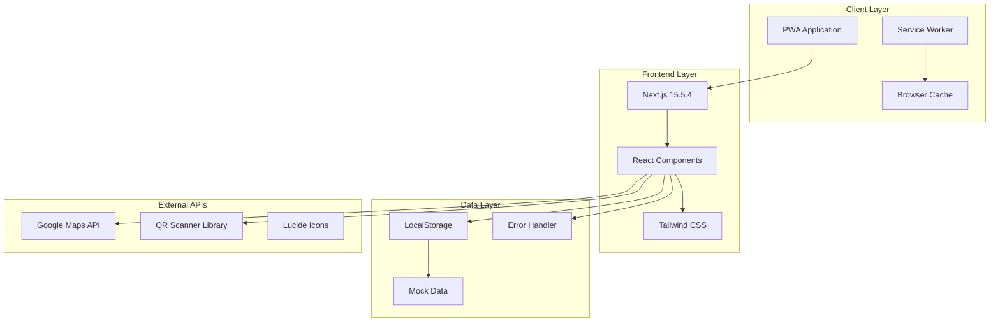
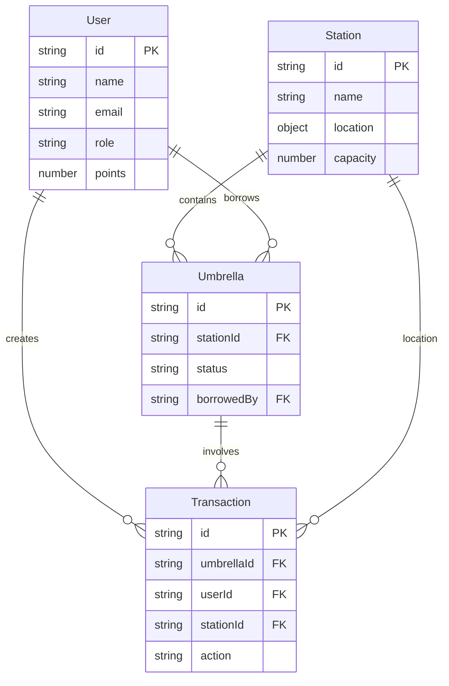

# 🏗️ Machikasa Technical Architecture

**Complete System Architecture Documentation**

---

## 📋 Table of Contents

1. [System Overview](#system-overview)
2. [Technology Stack](#technology-stack)
3. [Architecture Design](#architecture-design)
4. [Data Models](#data-models)
5. [Security Design](#security-design)
6. [Performance Optimization](#performance-optimization)
7. [Deployment Strategy](#deployment-strategy)
8. [Future Roadmap](#future-roadmap)

---

## 🎯 System Overview

### Design Philosophy

Machikasa's architecture is built on these core principles:

- **🎯 Simplicity**: Clean, understandable structure
- **📱 Mobile-First**: Optimized for smartphone usage
- **🔒 Privacy-First**: Minimal data collection, local storage
- **⚡ Performance**: Fast, responsive user experience
- **🛠️ Maintainability**: Easy to extend and modify
- **♿ Accessibility**: Inclusive design for all users

### System Architecture Diagram



---

## ⚙️ Technology Stack

### Frontend Framework

**Next.js 15.5.4 (App Router)**
- React Server Components support
- Excellent SEO and performance
- Full TypeScript support
- Static site generation capability

**React 18+**
- Hooks (useState, useEffect, useContext)
- Error Boundaries
- Suspense for loading states
- Full TypeScript integration

**TypeScript 5.0+**
- Strict type checking for code quality
- Enhanced developer experience
- Better refactoring support

### Styling & UI

**Tailwind CSS 3.4+**
- Utility-first CSS framework
- Custom color palette
- Mobile-responsive design system

**Lucide React Icons**
- Lightweight, consistent icon set
- Tree-shakable imports
- SVG-based for scalability

### PWA & Offline Support

**next-pwa**
- Service Worker for offline functionality
- Automatic caching strategies
- App-like user experience

**manifest.json**
- Progressive Web App configuration
- Home screen installation
- Native app behavior

### External APIs & Libraries

**Google Maps JavaScript API**
- Interactive map display
- Geolocation services
- Route planning

**@zxing/browser**
- In-browser QR code scanning
- No server-side processing required
- Camera API integration

**Recharts**
- Data visualization
- Interactive charts and graphs
- Responsive design

---

## 🏛️ Architecture Design

### Layer Structure

```
📱 Presentation Layer (UI/UX)
├── Pages (Next.js App Router)
├── Components (Reusable UI)
├── Hooks (Custom React Hooks)
└── Styles (Tailwind CSS)

🔧 Business Logic Layer
├── Utilities (Pure Functions)
├── Validators (Data Validation)
├── Formatters (Data Display)
└── Constants (Configuration)

💾 Data Access Layer
├── LocalDB (Storage Abstraction)
├── ErrorHandler (Error Management)
├── MockData (Test Data)
└── Types (TypeScript Definitions)

🌐 External Integration Layer
├── Google Maps API
├── QR Scanner
├── Service Worker
└── Browser APIs
```

### Component Architecture

Following Atomic Design principles:

**🔬 Atoms (Basic Building Blocks)**
```typescript
// Button.tsx - Basic interactive element
interface ButtonProps {
  variant: 'primary' | 'secondary' | 'danger';
  size: 'sm' | 'md' | 'lg';
  loading?: boolean;
  disabled?: boolean;
  onClick: () => void;
  children: React.ReactNode;
}

// LoadingSpinner.tsx - Loading indicators
interface LoadingSpinnerProps {
  size: 'sm' | 'md' | 'lg';
  color: 'blue' | 'green' | 'gray';
  text?: string;
}
```

**🧬 Molecules (Component Combinations)**
```typescript
// QRScanner.tsx - Camera integration
interface QRScannerProps {
  onScan: (result: string) => void;
  onError?: (error: string) => void;
  isActive: boolean;
}

// StationCard.tsx - Information display
interface StationCardProps {
  station: Station;
  onViewDetails: (id: string) => void;
  showUmbrellaCount?: boolean;
}
```

**🏗️ Organisms (Complex Components)**
```typescript
// Navbar.tsx - Application navigation
// Dashboard.tsx - Data visualization
// MapView.tsx - Interactive map
// ProfileSection.tsx - User information
```

### State Management Strategy

**Local Component State**
```typescript
// Temporary UI state within components
const [isLoading, setIsLoading] = useState(false);
const [error, setError] = useState<string | null>(null);
const [formData, setFormData] = useState<FormData>({});
```

**Global Application State**
```typescript
// Shared state across components using Context API
const UserContext = createContext<User | null>(null);
const ToastContext = createContext<ToastContextType>(defaultToastContext);

// Custom hooks for state management
export const useUser = () => {
  const context = useContext(UserContext);
  if (!context) throw new Error('useUser must be used within UserProvider');
  return context;
};
```

**Persistent Data Storage**
```typescript
// Browser localStorage for data persistence
class LocalDB {
  static getData<T>(key: string, defaultValue: T): T;
  static setData<T>(key: string, value: T): void;
  static removeData(key: string): void;
  static clearAll(): void;
}
```

### Error Handling Architecture

**Comprehensive Error Management**
```typescript
// lib/errorHandler.ts
export enum ERROR_CODES {
  CAMERA_ACCESS_DENIED = 'CAMERA_ACCESS_DENIED',
  STORAGE_QUOTA_EXCEEDED = 'STORAGE_QUOTA_EXCEEDED',
  NETWORK_ERROR = 'NETWORK_ERROR',
  INVALID_QR_CODE = 'INVALID_QR_CODE',
  UMBRELLA_NOT_AVAILABLE = 'UMBRELLA_NOT_AVAILABLE'
}

export class ErrorHandler {
  static handleCameraError(error: MediaError): ErrorDetails;
  static handleStorageError(error: DOMException): ErrorDetails;
  static handleNetworkError(error: Error): ErrorDetails;
  static getUserMessage(errorCode: string): string;
  static isRecoverable(errorCode: string): boolean;
}
```

---

## 📊 Data Models

### Core Entities

**User Model**
```typescript
interface User {
  id: string;                    // Unique identifier
  name: string;                  // English name
  nameJa: string;               // Japanese name
  email: string;                // Email address
  role: 'student' | 'staff' | 'admin';
  studentId?: string;           // Student ID number
  department?: string;          // Department/Faculty
  totalBorrows: number;         // Total borrow count
  totalReturns: number;         // Total return count
  points: number;               // Gamification points
  isActive: boolean;            // Active status
  createdAt: string;            // Registration date
  lastLoginAt: string;          // Last login timestamp
}
```

**Umbrella Model**
```typescript
interface Umbrella {
  id: string;                   // Umbrella ID (umb-001)
  code: string;                 // QR code content
  qrCode: string;              // Legacy QR code field
  status: UmbrellaStatus;      // Current status
  stationId: string;           // Current station
  lastUpdated: string;         // Last update timestamp
  borrowedBy?: string;         // Current borrower ID
  condition: UmbrellaCondition; // Physical condition
  batteryLevel?: number;       // Battery level (0-100)
}

type UmbrellaStatus = 'available' | 'in_use' | 'maintenance' | 'lost';
type UmbrellaCondition = 'good' | 'fair' | 'poor';
```

**Station Model**
```typescript
interface Station {
  id: string;                   // Station identifier
  name: string;                 // English name
  nameJa: string;              // Japanese name
  location: {                   // GPS coordinates
    lat: number;
    lng: number;
  };
  address: string;              // English address
  addressJa: string;           // Japanese address
  capacity: number;             // Maximum capacity
  currentCount: number;         // Current umbrella count
  type: 'university' | 'store' | 'public';
  operatingHours: {            // Operating hours
    open: string;              // "09:00"
    close: string;             // "21:00"
  };
  isActive: boolean;           // Operational status
}
```

**Transaction Model**
```typescript
interface Transaction {
  id: string;                   // Transaction ID
  umbrellaId: string;          // Target umbrella
  action: 'borrow' | 'return'; // Transaction type
  userId: string;              // User performing action
  stationId: string;           // Location of transaction
  timestamp: string;           // Transaction timestamp
  pointsEarned?: number;       // Points awarded
  weather?: string;            // Weather conditions
}
```

### Data Relationships



---

## 🔒 Security Design

### Privacy-First Architecture

**Data Minimization**
```typescript
// Only store essential data
interface MinimalUserData {
  id: string;           // Internal identification only
  nameJa: string;       // Display purposes only
  points: number;       // Gamification
  // ❌ No personal identifiers, addresses, or sensitive data
}
```

**Local Data Encryption**
```typescript
class SecureStorage {
  private static encrypt(data: string): string {
    // Simple encoding for prototype
    return btoa(encodeURIComponent(data));
  }
  
  private static decrypt(encryptedData: string): string {
    return decodeURIComponent(atob(encryptedData));
  }
  
  static setSecureData(key: string, data: any): void {
    const encrypted = this.encrypt(JSON.stringify(data));
    localStorage.setItem(key, encrypted);
  }
}
```

### Input Validation & Sanitization

**XSS Prevention**
```typescript
const sanitizeInput = (input: string): string => {
  return input
    .replace(/</g, '&lt;')
    .replace(/>/g, '&gt;')
    .replace(/"/g, '&quot;')
    .replace(/'/g, '&#x27;')
    .trim()
    .slice(0, 1000); // Limit input length
};

// QR Code validation
const isValidMachikasaQR = (qrCode: string): boolean => {
  const pattern = /^machikasa:\/\/umbrella\/[a-zA-Z0-9\-]+$/;
  return pattern.test(qrCode) && qrCode.length < 100;
};
```

**Content Security Policy**
```typescript
// next.config.js security headers
const securityHeaders = [
  {
    key: 'Content-Security-Policy',
    value: [
      "default-src 'self'",
      "script-src 'self' 'unsafe-eval' 'unsafe-inline' maps.googleapis.com",
      "style-src 'self' 'unsafe-inline' fonts.googleapis.com",
      "img-src 'self' data: blob: maps.gstatic.com",
      "connect-src 'self' maps.googleapis.com"
    ].join('; ')
  },
  {
    key: 'X-Frame-Options',
    value: 'DENY'
  },
  {
    key: 'X-Content-Type-Options',
    value: 'nosniff'
  }
];
```

---

## ⚡ Performance Optimization

### Frontend Performance

**Code Splitting & Lazy Loading**
```typescript
// Route-based code splitting
const AdminDashboard = lazy(() => import('@/app/admin/dashboard'));
const GoogleMap = lazy(() => import('@/components/GoogleMap'));

// Component-level splitting
const HeavyChart = lazy(() => import('@/components/HeavyChart'));

// Lazy loading with Suspense
<Suspense fallback={<LoadingSpinner />}>
  <AdminDashboard />
</Suspense>
```

**Optimized Asset Loading**
```typescript
// Next.js Image optimization
import Image from 'next/image';

<Image
  src="./sponsors/logo.svg"
  alt="Partner Logo"
  width={150}
  height={75}
  priority={false}
  loading="lazy"
  placeholder="blur"
  blurDataURL="data:image/svg+xml;base64,..."
/>
```

**Bundle Optimization**
```javascript
// next.config.js
module.exports = {
  experimental: {
    optimizePackageImports: ['lucide-react', 'recharts'],
  },
  compiler: {
    removeConsole: process.env.NODE_ENV === 'production',
  },
  webpack: (config, { dev, isServer }) => {
    if (!dev && !isServer) {
      config.optimization.splitChunks = {
        chunks: 'all',
        cacheGroups: {
          vendor: {
            test: /[\\/]node_modules[\\/]/,
            name: 'vendors',
            chunks: 'all',
          },
        },
      };
    }
    return config;
  },
};
```

### Data Management Performance

**Efficient Storage Operations**
```typescript
class PerformantLocalDB {
  private static cache = new Map<string, any>();
  private static lastModified = new Map<string, number>();
  
  static getData<T>(key: string): T | null {
    // Check memory cache first
    if (this.cache.has(key)) {
      return this.cache.get(key);
    }
    
    // Read from localStorage
    const data = localStorage.getItem(key);
    const parsed = data ? JSON.parse(data) : null;
    
    // Cache the result
    this.cache.set(key, parsed);
    this.lastModified.set(key, Date.now());
    
    return parsed;
  }
  
  static setData<T>(key: string, value: T): void {
    // Update cache
    this.cache.set(key, value);
    this.lastModified.set(key, Date.now());
    
    // Debounced localStorage write
    this.debouncedWrite(key, value);
  }
  
  private static debouncedWrite = debounce((key: string, value: any) => {
    localStorage.setItem(key, JSON.stringify(value));
  }, 500);
}
```

**Search Optimization**
```typescript
// Indexed search for large datasets
class SearchIndex {
  private static indexes = new Map<string, Map<string, string[]>>();
  
  static buildIndex(data: any[], fields: string[]): void {
    fields.forEach(field => {
      const fieldIndex = new Map<string, string[]>();
      
      data.forEach(item => {
        const value = item[field]?.toLowerCase() || '';
        const words = value.split(/\s+/);
        
        words.forEach(word => {
          if (!fieldIndex.has(word)) {
            fieldIndex.set(word, []);
          }
          fieldIndex.get(word)!.push(item.id);
        });
      });
      
      this.indexes.set(field, fieldIndex);
    });
  }
  
  static search(query: string, fields: string[]): string[] {
    const queryWords = query.toLowerCase().split(/\s+/);
    let results: Set<string> = new Set();
    
    queryWords.forEach(word => {
      fields.forEach(field => {
        const fieldIndex = this.indexes.get(field);
        if (fieldIndex?.has(word)) {
          fieldIndex.get(word)!.forEach(id => results.add(id));
        }
      });
    });
    
    return Array.from(results);
  }
}
```

### PWA Performance

**Service Worker Optimization**
```javascript
// public/sw.js - Optimized caching strategy
const CACHE_NAME = 'machikasa-v1.0.0';
const STATIC_CACHE = 'static-v1';
const DYNAMIC_CACHE = 'dynamic-v1';

// Cache-first for static assets
const cacheFirst = async (request) => {
  const cached = await caches.match(request);
  return cached || fetch(request);
};

// Network-first for API calls
const networkFirst = async (request) => {
  try {
    const response = await fetch(request);
    const cache = await caches.open(DYNAMIC_CACHE);
    cache.put(request, response.clone());
    return response;
  } catch (error) {
    return caches.match(request);
  }
};

self.addEventListener('fetch', (event) => {
  if (event.request.url.includes('/api/')) {
    event.respondWith(networkFirst(event.request));
  } else {
    event.respondWith(cacheFirst(event.request));
  }
});
```

---

## 🚀 Deployment Strategy

### Static Site Deployment

**Next.js Export Configuration**
```javascript
/** @type {import('next').NextConfig} */
const nextConfig = {
  output: 'export',
  trailingSlash: true,
  images: {
    unoptimized: true,
  },
  env: {
    CUSTOM_KEY: process.env.CUSTOM_KEY,
  },
  assetPrefix: isProd ? '/machikasa/' : '',
  basePath: isProd ? '/machikasa' : '',
};
```

**GitHub Actions CI/CD**
```yaml
name: Deploy to GitHub Pages

on:
  push:
    branches: [main]
  workflow_dispatch:

permissions:
  contents: read
  pages: write
  id-token: write

jobs:
  build:
    runs-on: ubuntu-latest
    steps:
      - uses: actions/checkout@v4
      
      - name: Setup Node.js
        uses: actions/setup-node@v4
        with:
          node-version: '18'
          cache: 'npm'
      
      - name: Install dependencies
        run: npm ci
      
      - name: Run tests
        run: npm run test
      
      - name: Build application
        run: npm run build
        
      - name: Upload artifact
        uses: actions/upload-pages-artifact@v2
        with:
          path: ./out
  
  deploy:
    environment:
      name: github-pages
      url: ${{ steps.deployment.outputs.page_url }}
    runs-on: ubuntu-latest
    needs: build
    steps:
      - name: Deploy to GitHub Pages
        id: deployment
        uses: actions/deploy-pages@v2
```

### Environment Management

**Multi-Environment Configuration**
```typescript
// lib/config.ts
interface EnvironmentConfig {
  APP_NAME: string;
  BASE_URL: string;
  GOOGLE_MAPS_API_KEY: string;
  DEBUG_MODE: boolean;
  ANALYTICS_ENABLED: boolean;
}

const config: EnvironmentConfig = {
  APP_NAME: process.env.NEXT_PUBLIC_APP_NAME || 'Machikasa',
  BASE_URL: process.env.NEXT_PUBLIC_BASE_URL || 'http://localhost:3000',
  GOOGLE_MAPS_API_KEY: process.env.NEXT_PUBLIC_GOOGLE_MAPS_API_KEY || '',
  DEBUG_MODE: process.env.NODE_ENV === 'development',
  ANALYTICS_ENABLED: process.env.NODE_ENV === 'production',
};

export default config;
```

**Build Scripts**
```json
{
  "scripts": {
    "dev": "next dev",
    "build": "next build",
    "build:analyze": "ANALYZE=true next build",
    "export": "next export",
    "start": "next start",
    "lint": "next lint --fix",
    "type-check": "tsc --noEmit",
    "test": "jest",
    "test:watch": "jest --watch",
    "test:coverage": "jest --coverage"
  }
}
```

---

## 🔮 Future Roadmap

### Phase 2: Backend Integration (Q2 2024)

**API Server Development**
```typescript
// Planned API architecture
interface APIEndpoints {
  // Authentication
  'POST /api/auth/login': { email: string; password: string };
  'POST /api/auth/logout': {};
  
  // User management
  'GET /api/users/profile': User;
  'PUT /api/users/profile': Partial<User>;
  
  // Umbrella operations
  'GET /api/umbrellas': Umbrella[];
  'GET /api/umbrellas/:id': Umbrella;
  'PUT /api/umbrellas/:id/borrow': { userId: string };
  'PUT /api/umbrellas/:id/return': { userId: string; stationId: string };
  
  // Station management
  'GET /api/stations': Station[];
  'POST /api/stations': Omit<Station, 'id'>;
  
  // Analytics
  'GET /api/analytics/dashboard': DashboardData;
  'GET /api/analytics/reports': ReportData;
}
```

**Database Schema Design**
```sql
-- PostgreSQL schema
CREATE TABLE users (
  id UUID PRIMARY KEY DEFAULT gen_random_uuid(),
  email VARCHAR(255) UNIQUE NOT NULL,
  password_hash VARCHAR(255) NOT NULL,
  name_ja VARCHAR(100) NOT NULL,
  role user_role NOT NULL DEFAULT 'student',
  points INTEGER DEFAULT 0,
  total_borrows INTEGER DEFAULT 0,
  total_returns INTEGER DEFAULT 0,
  is_active BOOLEAN DEFAULT true,
  created_at TIMESTAMP DEFAULT CURRENT_TIMESTAMP,
  updated_at TIMESTAMP DEFAULT CURRENT_TIMESTAMP
);

CREATE TABLE umbrellas (
  id VARCHAR(20) PRIMARY KEY,
  station_id UUID REFERENCES stations(id),
  status umbrella_status NOT NULL DEFAULT 'available',
  condition umbrella_condition NOT NULL DEFAULT 'good',
  borrowed_by UUID REFERENCES users(id),
  battery_level INTEGER CHECK (battery_level >= 0 AND battery_level <= 100),
  last_updated TIMESTAMP DEFAULT CURRENT_TIMESTAMP
);

CREATE TABLE transactions (
  id UUID PRIMARY KEY DEFAULT gen_random_uuid(),
  umbrella_id VARCHAR(20) REFERENCES umbrellas(id),
  user_id UUID REFERENCES users(id),
  station_id UUID REFERENCES stations(id),
  action transaction_action NOT NULL,
  points_earned INTEGER DEFAULT 0,
  timestamp TIMESTAMP DEFAULT CURRENT_TIMESTAMP
);
```

### Phase 3: Advanced Features (Q3 2024)

**Real-time Notifications**
```typescript
// Push notification service
interface NotificationService {
  sendUmbrellaReminder(userId: string, umbrellaId: string): Promise<void>;
  sendStationFullAlert(stationId: string): Promise<void>;
  sendWeatherWarning(userIds: string[], forecast: WeatherForecast): Promise<void>;
  sendMaintenanceNotice(affectedUsers: string[], message: string): Promise<void>;
}

// WebSocket integration
interface RealtimeUpdates {
  onUmbrellaStatusChange: (umbrellaId: string, status: UmbrellaStatus) => void;
  onStationCapacityUpdate: (stationId: string, count: number) => void;
  onNewTransaction: (transaction: Transaction) => void;
}
```

**Weather API Integration**
```typescript
// Weather-based recommendations
interface WeatherService {
  getCurrentWeather(lat: number, lng: number): Promise<CurrentWeather>;
  getForecast(lat: number, lng: number, days: number): Promise<WeatherForecast[]>;
  shouldRecommendUmbrella(forecast: WeatherForecast): boolean;
  getUmbrellaRecommendation(location: Location): Promise<UmbrellaRecommendation>;
}

interface UmbrellaRecommendation {
  recommended: boolean;
  reason: string;
  nearestStations: Station[];
  weatherAlert?: string;
}
```

**Advanced Analytics**
```typescript
// Machine learning integration
interface AnalyticsService {
  predictDemand(stationId: string, timestamp: Date): Promise<number>;
  optimizeDistribution(): Promise<DistributionPlan>;
  generateUsageInsights(period: DateRange): Promise<UsageInsights>;
  calculateROI(period: DateRange): Promise<ROIReport>;
}

interface DistributionPlan {
  recommendations: {
    fromStation: string;
    toStation: string;
    umbrellaCount: number;
    priority: 'high' | 'medium' | 'low';
  }[];
  expectedImprovement: number;
}
```

### Phase 4: Enterprise & Scale (Q4 2024)

**Multi-tenant Architecture**
```typescript
// Support for multiple organizations
interface TenantConfig {
  id: string;
  name: string;
  domain: string;
  branding: {
    logo: string;
    colors: {
      primary: string;
      secondary: string;
    };
    customCSS?: string;
  };
  features: {
    weatherIntegration: boolean;
    advancedAnalytics: boolean;
    customReports: boolean;
  };
  integrations: {
    ssoProvider?: string;
    paymentGateway?: string;
    notificationService?: string;
  };
}
```

**Microservices Architecture**
```typescript
// Service-oriented architecture
interface MicroservicesArchitecture {
  userService: {
    url: 'https://user-service.machikasa.com';
    endpoints: UserAPIEndpoints;
  };
  umbrellaService: {
    url: 'https://umbrella-service.machikasa.com';
    endpoints: UmbrellaAPIEndpoints;
  };
  locationService: {
    url: 'https://location-service.machikasa.com';
    endpoints: LocationAPIEndpoints;
  };
  notificationService: {
    url: 'https://notification-service.machikasa.com';
    endpoints: NotificationAPIEndpoints;
  };
  analyticsService: {
    url: 'https://analytics-service.machikasa.com';
    endpoints: AnalyticsAPIEndpoints;
  };
}
```

**Mobile App Development**
```typescript
// React Native mobile app
interface MobileAppFeatures {
  nativeQRScanner: boolean;
  pushNotifications: boolean;
  offlineMapCaching: boolean;
  biometricAuth: boolean;
  backgroundLocationTracking: boolean;
  nativeShare: boolean;
  deepLinking: boolean;
}

// React Native specific optimizations
interface MobileOptimizations {
  bundleSplitting: 'route' | 'feature' | 'vendor';
  imageOptimization: 'webp' | 'native';
  offlineStorage: 'sqlite' | 'realm' | 'mmkv';
  performanceMonitoring: 'flipper' | 'reactotron';
}
```

---

<div align="center">

**🏗️ Machikasa - Architecture for Sustainable Future**

**This architecture documentation serves as a guide for understanding the system and planning future enhancements.**

---

*This document is continuously updated with technological advances and system evolution.*

**Last Updated: December 8, 2024**

</div>