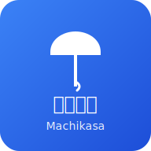

# 📖 Machikasa ユーザーマニュアル

<div align="center">



**まちかさ - 福井大学傘シェアリングアプリ**

**完全版ユーザーガイド**

</div>

---

## 📋 目次

1. [はじめに](#はじめに)
2. [アプリの始め方](#アプリの始め方)
3. [基本操作ガイド](#基本操作ガイド)
4. [各機能の詳細説明](#各機能の詳細説明)
5. [トラブルシューティング](#トラブルシューティング)
6. [よくある質問](#よくある質問)
7. [お問い合わせ](#お問い合わせ)

---

## 🌟 はじめに

### Machikasaとは？

**Machikasa（まちかさ）**は、福井大学の学生・教職員・地域住民が急な雨天時に傘を共有できるWebアプリケーションです。スマートフォンやタブレットから簡単に利用でき、特別なアプリのインストールは不要です。

### 基本理念

- **🤝 コミュニティ第一**: みんなで支え合う地域密着型のサービス
- **🌍 持続可能性**: 環境に優しく、経済的負担の少ないシステム
- **📱 簡単操作**: スマートフォンがあれば誰でも簡単に利用可能
- **🔒 プライバシー保護**: 個人情報は最小限に抑え、安全に管理

---

## 🚀 アプリの始め方

### 1. アクセス方法

**ブラウザから直接利用**
- スマートフォンのブラウザ（Chrome、Safari、Firefoxなど）で以下のURLにアクセス
- `https://your-app-url.github.io`（実際のURLは運営者から提供されます）

**PWA（Progressive Web App）として利用**
1. ブラウザでアプリにアクセス
2. ブラウザの「ホーム画面に追加」または「インストール」をタップ
3. アプリアイコンがホーム画面に追加され、ネイティブアプリのように利用可能

### 2. 初回セットアップ

アプリを初めて起動すると、デモユーザーとして自動的にログインされます。

**デフォルト設定**
- **ユーザー名**: 山田太郎
- **所属**: 福井大学工学部
- **初期ポイント**: 0pt

実際の運用時は、大学のメールアドレスや学生証番号での認証が実装される予定です。

---

## 📱 基本操作ガイド

### ナビゲーション構成

アプリは5つの主要ページで構成されています：

```
🏠 ホーム → 📷 QRスキャン → 🗺️ 地図 → 👤 プロフィール → 🎯 スポンサー
```

### 共通UI要素

**上部ナビゲーションバー**
- 📱 アプリ名とロゴ
- 🌐 言語切り替えボタン（日本語⇔English）
- 📊 管理者ページへのリンク（管理者のみ）

**下部スポンサーカルーセル**
- 地域パートナー店舗の情報
- 左右スワイプで店舗情報を閲覧
- タップで詳細情報を表示

---

## 🔍 各機能の詳細説明

### 🏠 ホームページ

**表示内容**
- システムの概要とWelcomeメッセージ
- 現在の利用状況統計
  - 📊 利用可能傘数
  - 🏢 アクティブステーション数
  - 👥 登録ユーザー数
- 📈 最近の利用トレンド
- 🎯 主要機能へのクイックアクセスボタン

**操作方法**
- 各統計カードをタップで詳細画面に移動
- 「QRスキャンを開始」ボタンでスキャンページに直接移動
- 「地図を見る」ボタンで地図ページに移動

### 📷 QRスキャンページ（メイン機能）

このページはMachikasaの核心機能です。傘の借用・返却をすべてここで行います。

#### **スキャナー部分**

**スキャン開始**
1. 「スキャンを開始」ボタンをタップ
2. カメラの使用許可を求められた場合は「許可」をタップ
3. 画面中央のフレーム内に傘のQRコードを合わせる
4. 自動的にQRコードが認識され、傘の情報が表示される

**手動入力（カメラが使用できない場合）**
1. 「手動でQRコードを入力」リンクをクリック
2. QRコードの内容を直接入力（例: `machikasa://umbrella/umb-001`）
3. 「スキャン実行」ボタンをタップ

**デモ用QRコード**
- 実際のQRコードがない場合は、アプリ内のデモ用QRコードを利用
- 「デモ用QRコード」セクションを展開
- 利用したいテストコードをタップ

#### **傘情報表示**

スキャン成功後、以下の情報が表示されます：

```
🆔 傘ID: umb-001
🏢 ステーション: 福井大学正門
📍 状態: 利用可能 / 使用中 / メンテナンス中
🔋 バッテリー: 85%（スマート傘の場合）
🗓️ 最終更新: 2024年12月8日 14:30
```

#### **アクション実行**

**傘を借りる場合**
- 緑色の「🚀 この傘を借りる」ボタンが表示
- ボタンをタップして借用確認
- 成功すると「貸出完了！」メッセージが表示
- ステーション内の傘数が自動的に減少

**傘を返す場合**
- 青色の「✅ この傘を返却する」ボタンが表示
- ボタンをタップして返却確認
- 成功すると「返却完了！+1pt獲得」メッセージが表示
- ステーション内の傘数が自動的に増加
- ポイントが自動的に加算

**エラー時の表示**
- 赤色のエラーメッセージが表示
- 一般的なエラー：
  - 「この傘は使用中です」
  - 「この傘を返却する権限がありません」
  - 「ステーションが満杯です」

### 🗺️ 地図ページ

地図上で傘ステーションとパートナー店舗の位置を確認できます。

#### **地図機能**

**基本操作**
- 📍 ピンチイン・アウト: 地図の拡大・縮小
- 🖐️ ドラッグ: 地図の移動
- 📍 現在地ボタン: 自分の位置に地図を移動（位置情報許可が必要）

**ステーション表示**
- 🏢 **青いピン**: 大学内ステーション
- 🏪 **緑のピン**: パートナー店舗
- 🔴 **赤いピン**: 満杯または利用不可のステーション

**情報ウィンドウ**
ピンをタップすると以下の情報を表示：
```
🏢 福井大学正門ステーション
📍 住所: 福井市文京3-9-1
⏰ 営業時間: 6:00 - 22:00
☂️ 利用可能傘数: 2/5本
📞 連絡先: 0776-XX-XXXX（管理者用）
```

#### **ルート案内**

- ステーション情報ウィンドウの「案内」ボタンをタップ
- デバイスの地図アプリ（Google Maps、Apple Mapsなど）が起動
- 現在地からステーションまでのルートを表示

### 👤 プロフィールページ

個人の利用履歴と統計を確認できます。

#### **基本情報表示**

```
👤 山田太郎（Yamada Taro）
🎓 福井大学工学部 情報・メディア工学科
📧 yamada.taro@fukui-u.ac.jp
📞 090-XXXX-XXXX（任意）
🗓️ 登録日: 2024年4月1日
🕐 最終利用: 2024年12月8日 14:30
```

#### **利用統計**

**ポイント・回数統計**
- 🏆 **現在ポイント**: 85pt（返却1回につき1pt獲得）
- 📈 **総借用回数**: 42回
- 📉 **総返却回数**: 41回
- 💯 **返却率**: 97.6%

**月別利用グラフ**
- 📊 過去6ヶ月の月別利用回数をグラフ表示
- 借用・返却の回数を区別して表示
- タップで詳細数値を確認

#### **利用履歴**

最新の利用履歴を時系列で表示：

```
📅 2024年12月8日 14:30
🚀 傘を借りる: umb-001
🏢 ステーション: 福井大学正門
⏱️ 所要時間: 約2時間30分

📅 2024年12月8日 12:00
✅ 傘を返却: umb-003 (+1pt獲得!)
🏪 パートナー店舗: ローソン福井大学店
🎉 感謝メッセージ: ありがとうございました！
```

**履歴フィルタリング**
- 📅 期間指定（今日、今週、今月、全期間）
- 🎯 操作種別（借用のみ、返却のみ、すべて）
- 🏢 ステーション指定

#### **エクスポート機能**

- 📊 「CSV出力」ボタンで利用履歴をダウンロード
- データ分析や記録保存に活用
- 出力内容：日時、操作、傘ID、ステーション名、獲得ポイント

### 🎯 スポンサーページ

地域パートナー店舗の詳細情報を表示します。

#### **パートナー店舗一覧**

**掲載店舗の例**
- ☕ **福井コーヒー**: 大学近くのカフェ、返却ボーナス2pt
- 📚 **鯖江ブックス**: 専門書店、返却時に読書クーポン配布
- 🍜 **味処みらい**: 地元料理店、返却時に割引券
- 🛒 **福井コープ**: 生協、返却時にエコポイント追加

**店舗詳細情報**
各店舗カードをタップすると詳細画面を表示：
```
☕ 福井コーヒー
📍 住所: 福井市文京2-3-4
⏰ 営業時間: 7:00 - 20:00（月-金）, 8:00 - 18:00（土日）
📞 電話: 0776-XX-XXXX
🌐 ウェブサイト: https://fukui-coffee.example.com
☂️ 傘返却可能: 5本まで
🎁 特典: 返却時にコーヒー1杯50円引き
```

#### **特典・キャンペーン情報**

- 🎉 期間限定キャンペーン
- 🏆 ポイント倍増デー
- 🛍️ 店舗独自の特典情報
- 📢 イベント・セール情報

---

## 🛠️ トラブルシューティング

### よくあるトラブルと解決方法

#### 📷 QRスキャンができない

**症状**: カメラが起動しない、QRコードを認識しない

**解決方法**:
1. **カメラの許可確認**
   - ブラウザの設定でカメラアクセスを許可
   - プライベートブラウジングモードの場合は無効にする

2. **手動入力を使用**
   - 「手動でQRコードを入力」リンクをクリック
   - QRコードの内容を直接入力

3. **デモコードでテスト**
   - アプリ内のデモ用QRコードで動作確認

4. **ブラウザ・デバイス確認**
   - 対応ブラウザ: Chrome 90+, Safari 14+, Firefox 88+
   - HTTPSでのアクセスが必要（PWA機能のため）

#### 🗺️ 地図が表示されない

**症状**: 地図ページが白い画面または読み込み中のまま

**解決方法**:
1. **インターネット接続確認**
   - Wi-Fiまたはモバイルデータの接続状態を確認

2. **ブラウザキャッシュクリア**
   - ブラウザの履歴・キャッシュを削除
   - ページを再読み込み

3. **位置情報設定**
   - デバイスの位置情報サービスを有効化
   - ブラウザの位置情報アクセスを許可

#### 💾 データが消えた・表示されない

**症状**: 利用履歴やポイントが表示されない

**解決方法**:
1. **ブラウザデータ確認**
   - 同じブラウザ・デバイスを使用しているか確認
   - プライベートブラウジングでは データが保存されない

2. **ローカルストレージクリア**
   - ブラウザの開発者ツール（F12）
   - Application > Local Storage > データを確認
   - 破損している場合は削除して再初期化

3. **デバイス・ブラウザ変更時**
   - データは端末のブラウザに保存される
   - 異なるデバイスでは履歴が表示されない

#### 🔄 オフライン機能が働かない

**症状**: インターネット接続なしでアプリが使用できない

**解決方法**:
1. **PWAインストール確認**
   - ブラウザの「ホーム画面に追加」を実行
   - Service Workerが正常に登録されているか確認

2. **初回接続確認**
   - オフライン機能は初回オンライン時に設定される
   - 一度オンラインでアプリ全体を読み込む必要がある

3. **ブラウザサポート確認**
   - 古いブラウザではPWA機能が制限される
   - 最新バージョンにアップデート

---

## ❓ よくある質問

### 🤔 基本的な質問

**Q: アプリのインストールは必要ですか？**
A: いいえ、不要です。Webブラウザから直接利用できます。ただし、「ホーム画面に追加」することでアプリのように使用でき、オフライン機能も利用できます。

**Q: 利用料金はかかりますか？**
A: 基本的に無料です。ただし、通信費（データ通信料）は利用者負担です。Wi-Fi環境での利用を推奨します。

**Q: 個人情報は安全ですか？**
A: はい。個人データはすべてお使いのデバイス内に保存され、外部サーバーには送信されません。ただし、アプリを削除したり、ブラウザデータを消去すると履歴は失われます。

**Q: どのデバイスで使用できますか？**
A: スマートフォン、タブレット、パソコンのWebブラウザで使用できます。特にスマートフォンでの使用に最適化されています。

### 🚀 機能に関する質問

**Q: QRコードをスキャンできませんが、どうすればよいですか？**
A: 以下の方法をお試しください：
1. カメラの許可設定を確認
2. 手動入力機能を使用
3. デモ用QRコードでテスト
4. 十分な明るさでスキャンを実行

**Q: 傘を借りたまま忘れてしまいました。どうすればよいですか？**
A: プロフィールページで現在借りている傘を確認し、最寄りのステーションまたはパートナー店舗で返却してください。長期間の借用は他の利用者に迷惑をかけるため、なるべく早期の返却をお願いします。

**Q: ポイントは何に使えますか？**
A: 現在のプロトタイプ版では表示のみですが、実運用時には以下の用途を検討中：
- パートナー店舗での割引
- 大学内施設の利用特典
- コミュニティイベントへの参加権

**Q: 壊れた傘を見つけました。どう報告すればよいですか？**
A: 傘の状態が悪い場合は、QRスキャンして情報を確認し、管理者ページまたは大学の施設管理部門にご報告ください。

### 🛠️ 技術的な質問

**Q: オフラインでも使用できますか？**
A: はい、PWA（Progressive Web App）機能により、一度アプリを読み込めばオフラインでも基本機能が使用できます。ただし、初回はオンライン接続が必要です。

**Q: データのバックアップはどうすればよいですか？**
A: プロフィールページの「CSV出力」機能で利用履歴をダウンロードできます。ただし、すべてのアプリデータのバックアップは現在サポートされていません。

**Q: 複数のデバイスで同じアカウントを使用できますか？**
A: 現在のプロトタイプ版では、データは各デバイスのブラウザに個別保存されるため、デバイス間でのデータ同期はできません。

---

## 📞 お問い合わせ

### 🎯 各種連絡先

**一般的な質問・使い方サポート**
- 📧 Email: support@machikasa.example.com
- 📞 電話: 0776-XX-XXXX（平日 9:00-17:00）
- 💬 チャット: アプリ内の「お問い合わせ」ボタン

**技術的な問題・バグ報告**
- 🐛 GitHub Issues: https://github.com/your-repo/machikasa/issues
- 📧 技術サポート: tech@machikasa.example.com

**システム管理・運営に関するお問い合わせ**
- 🏢 福井大学施設管理部門
- 📞 大学代表: 0776-XX-XXXX

**パートナー店舗・企業からのお問い合わせ**
- 🤝 事業開発: business@machikasa.example.com
- 📈 提携相談: partnership@machikasa.example.com

### 📝 サポート依頼時の情報

お問い合わせの際は、以下の情報をお知らせいただくとスムーズです：

```
🔍 【問題の詳細】
- 何をしようとしていましたか？
- どのような問題が発生しましたか？
- エラーメッセージは表示されましたか？

📱 【環境情報】
- デバイス: iPhone/Android/PC
- ブラウザ: Chrome/Safari/Firefox（バージョンも）
- インターネット接続: Wi-Fi/モバイルデータ

📸 【スクリーンショット】
- 問題が発生している画面のスクリーンショット
- エラーメッセージの画面キャプチャ
```

---

<div align="center">

**🌂 Machikasa - みんなで作る、持続可能な傘シェアリングコミュニティ**

**ご質問やご不明な点がございましたら、お気軽にお問い合わせください！**

---

*このマニュアルは定期的に更新されます。最新版は常にアプリ内またはウェブサイトでご確認ください。*

**Last Updated: 2024年12月8日**

</div>